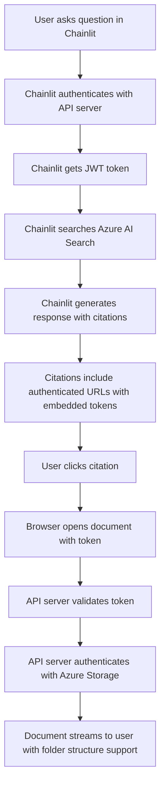

# 🔐 Authentication Integration Guide

## Overview

This document explains how authentication works between the **Chainlit app** (port 8000) and the **API server** (port 8001) to provide seamless document access with enterprise-grade security.

## 🏗️ Architecture



## 🔄 Authentication Flow

### 1. **Service-to-Service Authentication**
- Chainlit app acts as a **service client** to the API server
- Uses configured credentials (`API_SERVICE_USERNAME` / `API_SERVICE_PASSWORD`)
- Authenticates once at startup and maintains token for all document requests
- **Token refresh**: Automatic renewal when tokens expire (30-minute default)

### 2. **Token-Based Citation Links**
- Citation links include embedded JWT tokens for seamless access
- Format: `http://localhost:8001/api/file?doc_id={id}&token={jwt_token}`
- **Folder support**: Handles nested blob storage paths (`Finance/2024/Q4/report.pdf`)
- **Range requests**: Efficient streaming for large files

### 3. **Dual Authentication Methods**
The API server supports both authentication methods:
- **Authorization Header**: `Bearer {token}` (standard OAuth2)
- **Query Parameter**: `?token={token}` (for direct links from Chainlit)

### 4. **Azure Storage Authentication Priority**
1. **🏆 Service Principal** (recommended for production)
2. **🔑 Storage Account Key** (for development)
3. **☁️ Managed Identity** (for Azure deployment)
4. **🔄 Default Credential Chain** (fallback)

## 🛠️ Implementation Details

### **Chainlit App (`app.py`)**

#### Authentication Functions:
```python
async def authenticate_with_api_server():
    """Authenticate with API server and get access token"""
    auth_data = {
        "username": API_SERVICE_USERNAME,
        "password": API_SERVICE_PASSWORD
    }
    
    async with session.post(f"{API_SERVER_URL}/token", data=auth_data) as response:
        if response.status == 200:
            token_data = await response.json()
            return token_data.get("access_token")
        else:
            logger.error(f"Authentication failed: {response.status}")
            return None
```

#### Citation Generation with Token Embedding:
```python
async def get_authenticated_file_url(doc_id: str) -> Optional[str]:
    """Get authenticated file URL that includes the bearer token"""
    global api_token
    
    if not api_token:
        api_token = await authenticate_with_api_server()
        if not api_token:
            return None
    
    return f"{API_SERVER_URL}/api/file?doc_id={doc_id}&token={api_token}"
```

#### Blob Path Extraction (with Folder Support):
```python
def extract_blob_path_from_url(url: str) -> str:
    """Extract blob path from Azure Storage URL, preserving folder structure"""
    try:
        parsed_url = urlparse(url)
        # Extract path after container name
        path_parts = parsed_url.path.strip('/').split('/')
        if len(path_parts) >= 2:
            # Return everything after the container name (preserves folder structure)
            return '/'.join(path_parts[1:])
        return path_parts[-1] if path_parts else ""
    except Exception as e:
        logger.error(f"Error extracting blob path from URL {url}: {e}")
        return ""
```

### **API Server (`api_server.py`)**

#### Flexible Authentication:
```python
async def get_current_user_flexible(
    request: Request,
    token: Optional[str] = Query(None),
    authorization: Optional[str] = Header(None)
) -> User:
    """Accept tokens from either query params or Authorization header"""
    # Try query parameter first (for direct citation links)
    auth_token = token
    
    # Fall back to Authorization header
    if not auth_token and authorization:
        if authorization.startswith("Bearer "):
            auth_token = authorization.split(" ")[1]
    
    if not auth_token:
        raise HTTPException(
            status_code=401,
            detail="No authentication token provided"
        )
    
    # Validate JWT token
    try:
        payload = jwt.decode(auth_token, JWT_SECRET_KEY, algorithms=[ALGORITHM])
        username: str = payload.get("sub")
        if username is None:
            raise HTTPException(status_code=401, detail="Invalid token")
    except JWTError:
        raise HTTPException(status_code=401, detail="Invalid token")
    
    # Get user from database
    user = get_user(fake_users_db, username=username)
    if user is None:
        raise HTTPException(status_code=401, detail="User not found")
    
    return user
```

#### Azure Storage Authentication:
```python
def get_blob_service_client():
    """Get Azure Blob Service Client with flexible authentication"""
    try:
        # Priority 1: Service Principal (recommended for production)
        if all([AZURE_CLIENT_ID, AZURE_CLIENT_SECRET, AZURE_TENANT_ID]):
            logger.info("Using Service Principal authentication")
            credential = ClientSecretCredential(
                tenant_id=AZURE_TENANT_ID,
                client_id=AZURE_CLIENT_ID,
                client_secret=AZURE_CLIENT_SECRET
            )
            return BlobServiceClient(
                account_url=f"https://{AZURE_STORAGE_ACCOUNT_NAME}.blob.core.windows.net",
                credential=credential
            )
        
        # Priority 2: Storage Account Key
        elif AZURE_STORAGE_ACCOUNT_KEY:
            logger.info("Using Storage Account Key authentication")
            return BlobServiceClient(
                account_url=f"https://{AZURE_STORAGE_ACCOUNT_NAME}.blob.core.windows.net",
                credential=AZURE_STORAGE_ACCOUNT_KEY
            )
        
        # Priority 3: Managed Identity
        elif USE_MANAGED_IDENTITY:
            logger.info("Using Managed Identity authentication")
            credential = DefaultAzureCredential()
            return BlobServiceClient(
                account_url=f"https://{AZURE_STORAGE_ACCOUNT_NAME}.blob.core.windows.net",
                credential=credential
            )
        
        # Priority 4: Default credential chain
        else:
            logger.info("Using Default Azure Credential")
            credential = DefaultAzureCredential()
            return BlobServiceClient(
                account_url=f"https://{AZURE_STORAGE_ACCOUNT_NAME}.blob.core.windows.net",
                credential=credential
            )
            
    except Exception as e:
        logger.error(f"Failed to create blob service client: {e}")
        return None
```

#### File Streaming with Range Support:
```python
@app.get("/api/file")
async def stream_blob(
    doc_id: str,
    request: Request,
    current_user: User = Depends(get_current_user_flexible)
):
    """Stream documents with authentication and range request support"""
    try:
        # Get blob path from document ID
        blob_path = await get_blob_path_from_doc_id(doc_id)
        if not blob_path:
            raise HTTPException(status_code=404, detail="Document not found")
        
        # Get blob service client
        blob_service_client = get_blob_service_client()
        if not blob_service_client:
            raise HTTPException(status_code=500, detail="Storage authentication failed")
        
        # Download blob with range support
        blob_client = blob_service_client.get_blob_client(
            container=AZURE_STORAGE_CONTAINER_NAME,
            blob=blob_path
        )
        
        # Handle range requests for efficient streaming
        range_header = request.headers.get('range')
        if range_header:
            # Parse range and return partial content
            return await handle_range_request(blob_client, range_header)
        else:
            # Return full content
            blob_data = blob_client.download_blob().readall()
            return Response(
                content=blob_data,
                media_type=get_content_type(blob_path),
                headers={
                    "Content-Disposition": f"inline; filename={os.path.basename(blob_path)}",
                    "Accept-Ranges": "bytes"
                }
            )
            
    except Exception as e:
        logger.error(f"Error streaming blob {doc_id}: {e}")
        raise HTTPException(status_code=500, detail=str(e))
```

## 🔑 Environment Configuration

### **Development Environment**
```bash
# Chainlit App Environment
API_SERVER_URL=http://localhost:8001
API_SERVICE_USERNAME=testuser
API_SERVICE_PASSWORD=secret

# API Server Environment
JWT_SECRET_KEY=your-development-secret-key
ACCESS_TOKEN_EXPIRE_MINUTES=30

# Azure Storage (Development)
AZURE_STORAGE_ACCOUNT_KEY=your-storage-account-key
```

### **Production Environment**
```bash
# Chainlit App Environment
API_SERVER_URL=https://your-api-server.com
API_SERVICE_USERNAME=chainlit-service-account
API_SERVICE_PASSWORD=complex-secure-password

# API Server Environment
JWT_SECRET_KEY=complex-random-string-256-bits-from-key-vault
ACCESS_TOKEN_EXPIRE_MINUTES=30

# Azure Storage (Production - Service Principal)
AZURE_CLIENT_ID=your-service-principal-app-id
AZURE_CLIENT_SECRET=your-service-principal-secret
AZURE_TENANT_ID=your-azure-tenant-id

# Or use Managed Identity
USE_MANAGED_IDENTITY=true
```

## 🏢 **Enterprise Requirements**

### **1. Identity and Access Management**

#### **Azure Active Directory Integration**
Replace the demo user database with Azure AD:

```python
# Production user authentication
from azure.identity import DefaultAzureCredential
from msgraph import GraphServiceClient

async def authenticate_user_with_azure_ad(username: str, password: str):
    """Authenticate user with Azure AD (implementation example)"""
    try:
        # Use Azure AD B2C or Enterprise AD
        # This is a simplified example - implement proper AD integration
        credential = DefaultAzureCredential()
        graph_client = GraphServiceClient(credentials=credential)
        
        # Validate user exists and has required permissions
        user = await graph_client.users.by_user_id(username).get()
        
        # Check group membership for document access
        groups = await graph_client.users.by_user_id(username).member_of.get()
        
        return {
            "username": user.user_principal_name,
            "email": user.mail,
            "groups": [group.display_name for group in groups.value],
            "permissions": extract_permissions_from_groups(groups)
        }
    except Exception as e:
        logger.error(f"Azure AD authentication failed: {e}")
        return None
```

#### **Role-Based Access Control (RBAC)**
```python
# Document-level authorization
class DocumentPermissions:
    def __init__(self):
        self.user_permissions = {}
    
    def can_access_document(self, user: User, doc_id: str) -> bool:
        """Check if user can access specific document"""
        # Check user groups/roles
        if "admin" in user.groups:
            return True
        
        # Check document-specific permissions
        if doc_id in self.user_permissions.get(user.username, []):
            return True
        
        # Check departmental access
        doc_department = get_document_department(doc_id)
        return doc_department in user.departments
    
    def get_accessible_documents(self, user: User) -> List[str]:
        """Get list of documents user can access"""
        accessible_docs = []
        
        # Implementation based on user roles and permissions
        for doc_id in all_documents:
            if self.can_access_document(user, doc_id):
                accessible_docs.append(doc_id)
        
        return accessible_docs
```

### **2. Security Requirements**

#### **Network Security**
```bash
# Production network configuration
# 1. Enable Private Endpoints for Azure resources
az network private-endpoint create \
  --resource-group myRG \
  --name storage-private-endpoint \
  --vnet-name myVNet \
  --subnet mySubnet \
  --private-connection-resource-id /subscriptions/.../storageAccounts/myaccount \
  --connection-name myconnection \
  --group-id blob

# 2. Configure Network Security Groups
az network nsg rule create \
  --resource-group myRG \
  --nsg-name myNSG \
  --name allow-https \
  --protocol Tcp \
  --priority 100 \
  --destination-port-range 443 \
  --access Allow

# 3. Enable Azure Firewall
az extension add --name azure-firewall
az network firewall create \
  --resource-group myRG \
  --name myFirewall \
  --location eastus
```

#### **Data Encryption**
```bash
# 1. Enable encryption at rest for Azure Storage
az storage account update \
  --resource-group myRG \
  --name mystorageaccount \
  --encryption-services blob file \
  --encryption-key-source Microsoft.Storage

# 2. Enable encryption in transit (HTTPS only)
az storage account update \
  --resource-group myRG \
  --name mystorageaccount \
  --https-only true

# 3. Use Azure Key Vault for secrets
az keyvault create \
  --resource-group myRG \
  --name myKeyVault \
  --location eastus \
  --enabled-for-deployment \
  --enabled-for-template-deployment
```

#### **Secrets Management**
```python
# Production secrets management
from azure.keyvault.secrets import SecretClient
from azure.identity import DefaultAzureCredential

def get_secret_from_keyvault(secret_name: str) -> str:
    """Get secret from Azure Key Vault"""
    try:
        credential = DefaultAzureCredential()
        client = SecretClient(
            vault_url="https://your-keyvault.vault.azure.net/",
            credential=credential
        )
        secret = client.get_secret(secret_name)
        return secret.value
    except Exception as e:
        logger.error(f"Failed to get secret {secret_name}: {e}")
        return None

# Use in configuration
JWT_SECRET_KEY = get_secret_from_keyvault("jwt-secret-key")
AZURE_CLIENT_SECRET = get_secret_from_keyvault("service-principal-secret")
```

### **3. Compliance and Auditing**

#### **Audit Logging**
```python
# Comprehensive audit logging
import json
from datetime import datetime

class AuditLogger:
    def __init__(self):
        self.audit_log = logging.getLogger("audit")
        self.audit_log.setLevel(logging.INFO)
        
        # Configure structured logging
        handler = logging.handlers.RotatingFileHandler(
            "audit.log", maxBytes=10485760, backupCount=5
        )
        formatter = logging.Formatter(
            '%(asctime)s - %(levelname)s - %(message)s'
        )
        handler.setFormatter(formatter)
        self.audit_log.addHandler(handler)
    
    def log_authentication(self, user: str, success: bool, ip_address: str):
        """Log authentication events"""
        self.audit_log.info(json.dumps({
            "event_type": "authentication",
            "user": user,
            "success": success,
            "ip_address": ip_address,
            "timestamp": datetime.utcnow().isoformat(),
            "service": "api_server"
        }))
    
    def log_document_access(self, user: str, doc_id: str, action: str):
        """Log document access events"""
        self.audit_log.info(json.dumps({
            "event_type": "document_access",
            "user": user,
            "document_id": doc_id,
            "action": action,
            "timestamp": datetime.utcnow().isoformat(),
            "service": "api_server"
        }))
    
    def log_security_event(self, event_type: str, details: dict):
        """Log security events"""
        self.audit_log.warning(json.dumps({
            "event_type": event_type,
            "details": details,
            "timestamp": datetime.utcnow().isoformat(),
            "service": "api_server"
        }))

# Usage in API endpoints
audit_logger = AuditLogger()

@app.post("/token")
async def login(request: Request, form_data: OAuth2PasswordRequestForm = Depends()):
    user = authenticate_user(fake_users_db, form_data.username, form_data.password)
    if not user:
        audit_logger.log_authentication(
            form_data.username, False, request.client.host
        )
        raise HTTPException(status_code=401, detail="Incorrect credentials")
    
    audit_logger.log_authentication(
        form_data.username, True, request.client.host
    )
    # ... rest of login logic
```

#### **Data Loss Prevention (DLP)**
```python
# Document access controls
class DLPController:
    def __init__(self):
        self.restricted_patterns = [
            r'\b\d{3}-\d{2}-\d{4}\b',  # SSN pattern
            r'\b\d{4}[- ]?\d{4}[- ]?\d{4}[- ]?\d{4}\b',  # Credit card pattern
            r'\b[A-Za-z0-9._%+-]+@[A-Za-z0-9.-]+\.[A-Z|a-z]{2,}\b'  # Email pattern
        ]
    
    def scan_document_content(self, content: str) -> List[str]:
        """Scan document for sensitive information"""
        violations = []
        for pattern in self.restricted_patterns:
            if re.search(pattern, content):
                violations.append(f"Sensitive pattern detected: {pattern}")
        return violations
    
    def apply_redaction(self, content: str) -> str:
        """Apply redaction to sensitive content"""
        for pattern in self.restricted_patterns:
            content = re.sub(pattern, "[REDACTED]", content)
        return content
```

### **4. Monitoring and Alerting**

#### **Application Insights Integration**
```python
# Enhanced monitoring
from azure.monitor.opentelemetry import configure_azure_monitor
from opentelemetry import trace
from opentelemetry.instrumentation.fastapi import FastAPIInstrumentor

# Configure Application Insights
configure_azure_monitor(
    connection_string="InstrumentationKey=your-instrumentation-key"
)

# Instrument FastAPI
FastAPIInstrumentor.instrument_app(app)

# Custom telemetry
tracer = trace.get_tracer(__name__)

@app.get("/api/file")
async def stream_blob(doc_id: str, request: Request, current_user: User = Depends(get_current_user_flexible)):
    with tracer.start_as_current_span("stream_blob") as span:
        span.set_attribute("document_id", doc_id)
        span.set_attribute("user", current_user.username)
        
        try:
            # ... blob streaming logic
            span.set_attribute("status", "success")
            return response
        except Exception as e:
            span.set_attribute("status", "error")
            span.set_attribute("error", str(e))
            raise
```

#### **Health Monitoring**
```python
# Advanced health checks
from typing import Dict, Any

@app.get("/health")
async def health_check() -> Dict[str, Any]:
    """Comprehensive health check"""
    health_status = {
        "status": "healthy",
        "timestamp": datetime.utcnow().isoformat(),
        "version": "2.1.0",
        "services": {}
    }
    
    # Check Azure Storage connectivity
    try:
        blob_service_client = get_blob_service_client()
        blob_service_client.get_account_information()
        health_status["services"]["azure_storage"] = "healthy"
    except Exception as e:
        health_status["services"]["azure_storage"] = f"unhealthy: {str(e)}"
        health_status["status"] = "degraded"
    
    # Check Azure AI Search connectivity
    try:
        search_client = get_search_client()
        search_client.get_index_statistics()
        health_status["services"]["azure_search"] = "healthy"
    except Exception as e:
        health_status["services"]["azure_search"] = f"unhealthy: {str(e)}"
        health_status["status"] = "degraded"
    
    # Check JWT functionality
    try:
        test_token = create_access_token(data={"sub": "health_check"})
        jwt.decode(test_token, JWT_SECRET_KEY, algorithms=[ALGORITHM])
        health_status["services"]["jwt_auth"] = "healthy"
    except Exception as e:
        health_status["services"]["jwt_auth"] = f"unhealthy: {str(e)}"
        health_status["status"] = "unhealthy"
    
    return health_status
```

## 📊 Authentication Methods Comparison

| Method | Security Level | Use Case | User Experience | Enterprise Ready |
|--------|---------------|----------|-----------------|------------------|
| **Current Implementation** | High | Production | Seamless | ✅ Yes |
| **Service Principal** | Very High | Production | Seamless | ✅ Yes |
| **Managed Identity** | Very High | Azure Cloud | Seamless | ✅ Yes |
| **Manual Auth (Legacy)** | Medium | Development | Poor | ❌ No |

## 🧪 Testing the Integration

### **1. Run the Demo Script**
```bash
python demo_auth_integration.py
```

### **2. Enterprise Testing**
```bash
# Test with production-like configuration
export JWT_SECRET_KEY=$(openssl rand -hex 32)
export USE_MANAGED_IDENTITY=true
export API_SERVER_URL=https://your-staging-api.com

# Run comprehensive tests
python -m pytest tests/test_authentication.py -v
python -m pytest tests/test_authorization.py -v
python -m pytest tests/test_security.py -v
```

### **3. Load Testing**
```bash
# Install load testing tools
pip install locust

# Run load tests
locust -f tests/load_test.py --host=http://localhost:8001
```

### **4. Security Testing**
```bash
# Install security testing tools
pip install bandit safety

# Run security scans
bandit -r . -f json -o security_report.json
safety check --json --output security_vulnerabilities.json
```

## 🚀 **Production Deployment**

### **1. Azure App Service with Managed Identity**
```bash
# Create App Service with managed identity
az webapp create \
  --resource-group myRG \
  --plan myPlan \
  --name chainlit-api-prod \
  --runtime "PYTHON|3.11"

# Enable system-assigned managed identity
az webapp identity assign \
  --resource-group myRG \
  --name chainlit-api-prod

# Get the managed identity principal ID
PRINCIPAL_ID=$(az webapp identity show \
  --resource-group myRG \
  --name chainlit-api-prod \
  --query principalId --output tsv)

# Assign Storage Blob Data Reader role
az role assignment create \
  --assignee $PRINCIPAL_ID \
  --role "Storage Blob Data Reader" \
  --scope "/subscriptions/$(az account show --query id -o tsv)/resourceGroups/myRG/providers/Microsoft.Storage/storageAccounts/mystorageaccount"
```

### **2. Container Deployment with Azure Container Registry**
```bash
# Build and push container
az acr build --registry myregistry --image chainlit-ai-search:latest .

# Deploy to Container Apps with managed identity
az containerapp create \
  --name chainlit-ai-search-prod \
  --resource-group myRG \
  --environment myContainerEnv \
  --image myregistry.azurecr.io/chainlit-ai-search:latest \
  --target-port 8000 \
  --ingress 'external' \
  --system-assigned \
  --env-vars USE_MANAGED_IDENTITY=true \
            API_SERVER_URL=https://api.yourcompany.com \
            JWT_SECRET_KEY=secretref:jwt-secret
```

### **3. Multi-Region Deployment**
```bash
# Deploy to multiple regions for high availability
regions=("eastus" "westus" "centralus")

for region in "${regions[@]}"; do
  az webapp create \
    --resource-group myRG-$region \
    --plan myPlan-$region \
    --name chainlit-api-$region \
    --runtime "PYTHON|3.11" \
    --location $region
done

# Configure Traffic Manager for load balancing
az network traffic-manager profile create \
  --resource-group myRG \
  --name chainlit-traffic-manager \
  --routing-method Geographic
```

## 🔒 **Security Best Practices**

### **1. Network Security**
- ✅ Use HTTPS only (TLS 1.2+)
- ✅ Implement Web Application Firewall (WAF)
- ✅ Use Azure Private Endpoints for storage access
- ✅ Configure Network Security Groups (NSGs)
- ✅ Enable DDoS protection

### **2. Identity and Access**
- ✅ Integrate with Azure Active Directory
- ✅ Implement role-based access control (RBAC)
- ✅ Use service principals with minimal permissions
- ✅ Enable multi-factor authentication (MFA)
- ✅ Regular access reviews and permission audits

### **3. Data Protection**
- ✅ Encrypt data at rest and in transit
- ✅ Use Azure Key Vault for secrets management
- ✅ Implement data loss prevention (DLP)
- ✅ Regular backup and disaster recovery testing
- ✅ Data retention and deletion policies

### **4. Monitoring and Compliance**
- ✅ Enable comprehensive audit logging
- ✅ Monitor authentication and authorization events
- ✅ Set up security alerts and incident response
- ✅ Regular security assessments and penetration testing
- ✅ Compliance reporting (SOC 2, ISO 27001, etc.)

## 🐛 **Troubleshooting**

### **Common Issues**

#### **1. "Service Principal authentication failed"**
```bash
# Check service principal permissions
az role assignment list --assignee YOUR_CLIENT_ID --output table

# Verify service principal exists
az ad sp show --id YOUR_CLIENT_ID

# Test authentication
az login --service-principal \
  --username YOUR_CLIENT_ID \
  --password YOUR_CLIENT_SECRET \
  --tenant YOUR_TENANT_ID
```

#### **2. "Managed Identity authentication failed"**
```bash
# Check if managed identity is enabled
az webapp identity show --resource-group myRG --name myapp

# Verify role assignments
az role assignment list --assignee $(az webapp identity show --resource-group myRG --name myapp --query principalId -o tsv)

# Test from within the service
curl -H "Metadata: true" "http://169.254.169.254/metadata/identity/oauth2/token?api-version=2018-02-01&resource=https://storage.azure.com/"
```

#### **3. "JWT token validation failed"**
```bash
# Check token expiration
python -c "
import jwt
import json
token = 'your-token-here'
decoded = jwt.decode(token, verify=False)
print(json.dumps(decoded, indent=2))
"

# Verify JWT secret consistency
echo $JWT_SECRET_KEY | wc -c  # Should be 64+ characters
```

---

**Last Updated**: June 2025  
**Version**: 2.1.0  
**Enterprise Ready**: ✅ Yes 