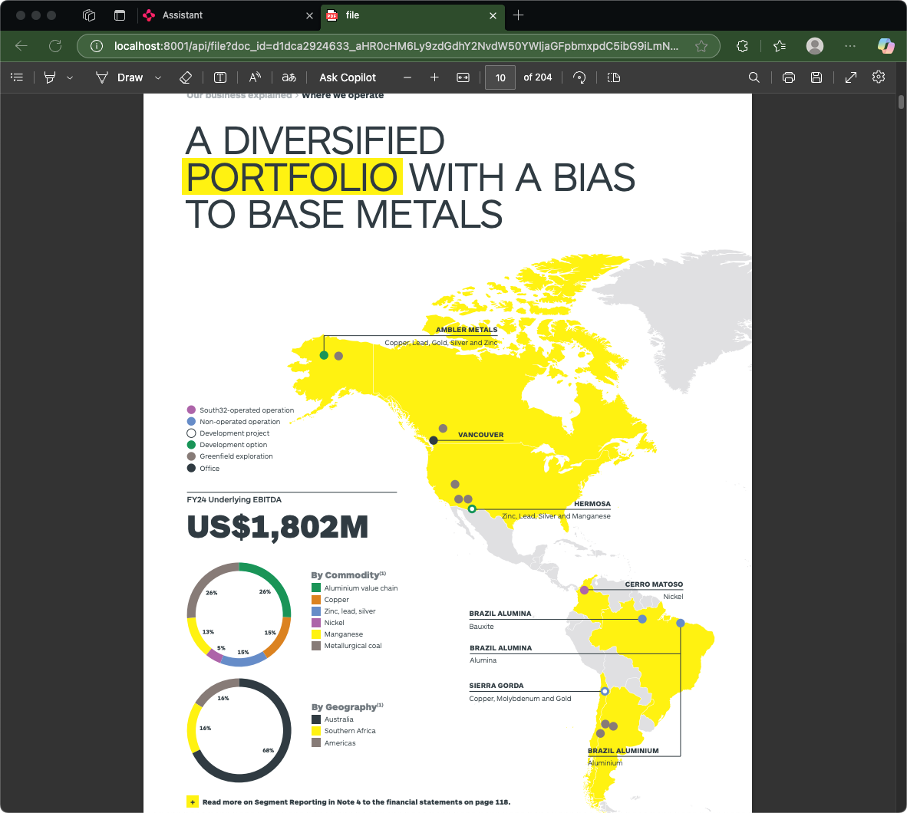

# 🔍✨ Enhanced Azure AI Search Assistant with Chainlit

A **production-ready** Azure AI Search integration for Chainlit with **secure authentication**, **in-app document viewers**, and **seamless citation system**. This intelligent chat application provides document-aware responses with clickable citations and supports enterprise deployment.

## 🆕 **Key Features**

### 🔍 **Advanced Vector Search**
- **Vector Search with text-embedding-3-small** for semantic similarity
- **Hybrid Search** combining vector and traditional text search
- **Intelligent Query Understanding** using Azure OpenAI embeddings
- **Configurable Search Types** (vector, text, or hybrid)

### 🔐 **Enterprise-Grade Authentication**
- **Service Principal Authentication** (recommended for production)
- **Storage Account Key** support for development
- **Managed Identity** support for Azure deployment
- **JWT-based API authentication** with dual token support (header + query param)
- **Document-level authorization** and access control
- **Seamless authentication flow** - citations work without manual login

### 📱 **Advanced Document Viewers**
- **PDF Viewer**: Navigate pages, zoom, print functionality
- **Word Documents**: Rendered as formatted HTML
- **Excel/CSV**: Interactive tables with sorting capabilities
- **Markdown**: Formatted text with syntax highlighting
- **Images & Videos**: Native preview support
- **10+ File Types** supported with proper MIME handling

### 🔗 **Smart Citation System**
- **Token-Embedded URLs**: Secure direct access to documents
- **Folder Structure Support**: Handles nested blob storage organization (`Finance/2024/Q4/report.pdf`)
- **Range Request Support**: Efficient streaming for large files
- **Automatic Authentication**: No manual login required for document access

### 🏗️ **Dual Architecture Support**
- **Option 1**: Simple Chainlit app for development and basic use
- **Option 2**: Full FastAPI + Chainlit integration for production features

## 🏗️ **Architecture Overview**


## 🎬 **Solution in Action**

See the Enhanced Azure AI Search Assistant in action with real document search and seamless citation links:

### **1. Welcome & Setup**

*Clean, intuitive interface with clear setup instructions and feature overview*

### **2. Intelligent Search & Citations**

*AI searches the knowledge base and provides accurate answers with clickable document citations*

### **3. Seamless Document Viewing**

*Click any citation to instantly open the source document with full PDF viewer functionality*

### **🔗 Complete Workflow:**
1. **Ask a Question** → AI searches Azure AI Search index
2. **Get Intelligent Answer** → Response includes relevant citations  
3. **Click Citation Link** → Document opens immediately in secure viewer
4. **View Source Content** → Full PDF with navigation, zoom, and print capabilities

> **No manual authentication required!** The JWT token system handles security seamlessly in the background.

## 🚀 **Quick Start**

### **Prerequisites**
- **Python 3.9+** installed
- **Azure Account** with access to:
  - Azure OpenAI (with model deployment)
  - Azure AI Search (with configured index)
  - Azure Blob Storage (with documents)

### **One-Command Setup (Demo/Development)**
```bash
# Clone and navigate to the project
cd chainlit-sample-azure-ai-search

# Run the enhanced launcher (installs deps, configures env, starts services)
python run_enhanced.py
```

> **Note**: This is perfect for demos, development, and first-time setup. For production deployment, use the manual setup or proper service orchestration.

### **Manual Setup**
```bash
# 1. Create virtual environment
python -m venv venv

# Activate virtual environment
# macOS/Linux:
source venv/bin/activate
# Windows:
venv\Scripts\activate

# 2. Install dependencies
pip install -r requirements.txt

# 3. Configure environment
cp .env.example .env
# Edit .env with your Azure credentials

# 4. Start services
# Terminal 1: API server
python api_server.py

# Terminal 2: Chainlit app
chainlit run app.py
```

## 🔧 **Configuration**

### **Environment Variables**

Create a `.env` file with your Azure credentials:

```bash
# Azure OpenAI Configuration
AZURE_OPENAI_API_KEY=your_azure_openai_api_key
AZURE_OPENAI_ENDPOINT=https://your-resource-name.openai.azure.com/
AZURE_OPENAI_API_VERSION=2023-07-01-preview
AZURE_OPENAI_DEPLOYMENT_NAME=your_model_deployment_name
AZURE_OPENAI_EMBEDDING_DEPLOYMENT=text-embedding-3-small

# Azure AI Search Configuration
AZURE_SEARCH_SERVICE_ENDPOINT=https://your-search-service.search.windows.net
AZURE_SEARCH_API_KEY=your_search_api_key
AZURE_SEARCH_INDEX_NAME=your_search_index_name
VECTOR_FIELD_NAME=text_vector

# Azure Storage Configuration
AZURE_STORAGE_ACCOUNT_NAME=your_storage_account_name
AZURE_STORAGE_CONTAINER_NAME=your_container_name

# Authentication Options (choose one)
# Option 1: Service Principal (RECOMMENDED for production)
AZURE_CLIENT_ID=your-service-principal-app-id
AZURE_CLIENT_SECRET=your-service-principal-secret
AZURE_TENANT_ID=your-azure-tenant-id

# Option 2: Storage Account Key (for development)
AZURE_STORAGE_ACCOUNT_KEY=your-storage-account-key

# Option 3: Managed Identity (for Azure deployment)
USE_MANAGED_IDENTITY=true

# API Server Authentication
API_SERVER_URL=http://localhost:8001
API_SERVICE_USERNAME=testuser
API_SERVICE_PASSWORD=secret
JWT_SECRET_KEY=your-jwt-secret-key-change-this-in-production
```

### **Azure AI Search Index Requirements**

Your Azure AI Search index must include these fields:

| Field Name | Type | Properties | Description |
|------------|------|------------|-------------|
| `chunk_id` | String | Key, Retrievable | Unique identifier for document chunks |
| `title` | String | Searchable, Retrievable | Document title |
| `chunk` | String | Searchable, Retrievable | Document content for searching |
| `text_vector` | Collection(Edm.Single) | Searchable | Vector embeddings (1536 dimensions for text-embedding-3-small) |
| `metadata_storage_path` | String | Retrievable | Full URL to source file in blob storage |
| `metadata_content_type` | String | Retrievable | MIME type of the source file |
| `metadata_storage_name` | String | Retrievable | Display name for the source file |

**Vector Search Requirements**:
- **Vector Field**: Must contain embeddings generated with `text-embedding-3-small` (1536 dimensions)
- **Similarity Function**: Cosine similarity recommended for text embeddings
- **Vector Configuration**: Configure vector search algorithm (HNSW recommended for performance)

**Note**: The `chunk_id` field should be **searchable** but doesn't need to be **filterable** for this implementation.

## 🎯 **Features in Detail**

### **1. Authentication & Authorization**

#### **Service Principal Setup (Recommended)**
```bash
# Create service principal with Storage Blob Data Reader role
az ad sp create-for-rbac \
  --name "chainlit-blob-access" \
  --role "Storage Blob Data Reader" \
  --scopes "/subscriptions/$(az account show --query id -o tsv)/resourceGroups/YOUR_RG/providers/Microsoft.Storage/storageAccounts/your_storage_account"
```

#### **Authentication Priority Order**
1. **🏆 Service Principal** (if `AZURE_CLIENT_ID`, `AZURE_CLIENT_SECRET`, `AZURE_TENANT_ID` are all provided)
2. **🔑 Storage Account Key** (if `AZURE_STORAGE_ACCOUNT_KEY` is provided)
3. **☁️ Managed Identity** (if `USE_MANAGED_IDENTITY=true`)
4. **🔄 Default Credential Chain** (fallback)

#### **How Authentication Works**
1. **Chainlit authenticates** with API server using service credentials
2. **JWT tokens** are embedded in citation URLs automatically
3. **Users click citations** → Documents open immediately (no manual login)
4. **API server validates** tokens and streams documents securely

### **2. Document Viewers**

| File Type | Viewer Features | Supported Extensions |
|-----------|----------------|-------------------|
| **PDF** | Page navigation, zoom, print | `.pdf` |
| **Word** | Formatted HTML rendering | `.docx`, `.doc` |
| **Excel** | Interactive tables, sorting | `.xlsx`, `.xls` |
| **CSV** | Formatted tables | `.csv` |
| **Markdown** | Formatted text, syntax highlighting | `.md` |
| **Images** | Native preview, full-size view | `.jpg`, `.png`, `.gif` |
| **Videos** | HTML5 player with controls | `.mp4`, `.avi` |
| **Text** | Syntax highlighting | `.txt`, `.json`, `.xml` |

### **3. Folder Structure Support**

The system now properly handles nested folder structures in Azure Blob Storage:

**Example**: 
- **Storage URL**: `https://account.blob.core.windows.net/documents/Finance/2024/Q4/report.pdf`
- **Extracted Path**: `Finance/2024/Q4/report.pdf`
- **Result**: Maintains complete folder hierarchy

### **4. API Endpoints**

#### **Authentication**
```http
POST /token
Content-Type: application/x-www-form-urlencoded

username=testuser&password=secret
```

#### **File Streaming**
```http
GET /api/file?doc_id={document_id}&token={jwt_token}
# Supports nested folders and range requests
```

#### **Health Check**
```http
GET /health
```

## 🔒 **Enterprise Security & Production Deployment**

### **Enterprise Security Requirements**

#### **1. Authentication & Identity**
```bash
# Production JWT Configuration
JWT_SECRET_KEY=$(openssl rand -hex 32)  # Generate strong secret
ACCESS_TOKEN_EXPIRE_MINUTES=30          # Token expiration

# Azure AD Integration (recommended)
# Replace fake_users_db with Azure AD authentication
# Implement proper user roles and permissions
```

#### **2. Network Security**
```bash
# HTTPS Configuration
API_SERVER_URL=https://your-api-server.com

# CORS Configuration (restrict origins in production)
CORS_ORIGINS=["https://your-frontend.com", "https://your-admin.com"]

# Firewall Rules
# - Allow HTTPS (443) only
# - Restrict API server (8001) to internal network
# - Enable Azure Private Endpoints for storage/search
```

#### **3. Azure Resource Security**
```bash
# Service Principal Permissions (minimal required)
- Storage Blob Data Reader (on storage account)
- Search Index Data Reader (on search service)
- Cognitive Services OpenAI User (on OpenAI resource)

# Managed Identity (for Azure deployment)
# Assign same roles to the managed identity
# Enable system-assigned identity on App Service/Container
```

### **Production Deployment Options**

#### **Option 1: Azure App Service**
```bash
# 1. Create App Service
az webapp create \
  --resource-group myRG \
  --plan myPlan \
  --name chainlit-ai-search \
  --runtime "PYTHON|3.11"

# 2. Enable managed identity
az webapp identity assign \
  --resource-group myRG \
  --name chainlit-ai-search

# 3. Configure environment variables
az webapp config appsettings set \
  --resource-group myRG \
  --name chainlit-ai-search \
  --settings @production.env.json

# 4. Deploy using GitHub Actions or Azure DevOps
```

#### **Option 2: Azure Container Apps**
```bash
# 1. Create container app
az containerapp create \
  --name chainlit-ai-search \
  --resource-group myRG \
  --environment myContainerEnv \
  --image your-registry/chainlit-ai-search:latest \
  --target-port 8000 \
  --ingress 'external' \
  --env-vars @production.env

# 2. Enable managed identity
az containerapp identity assign \
  --name chainlit-ai-search \
  --resource-group myRG \
  --system-assigned
```

#### **Option 3: Docker Deployment**
```dockerfile
# Dockerfile
FROM python:3.11-slim

WORKDIR /app
COPY requirements.txt .
RUN pip install -r requirements.txt

COPY . .

# Health check
HEALTHCHECK --interval=30s --timeout=10s --start-period=60s --retries=3 \
  CMD curl --fail http://localhost:8000/health || exit 1

# Multi-service startup
CMD ["python", "run_enhanced.py"]
```

### **Monitoring & Logging**

#### **Application Insights Integration**
```python
# Add to both app.py and api_server.py
from azure.monitor.opentelemetry import configure_azure_monitor

configure_azure_monitor(
    connection_string="InstrumentationKey=your-key"
)
```

#### **Health Monitoring**
- **API Server Health**: `https://your-app.com/health`
- **Chainlit Availability**: Monitor chat interface responsiveness
- **Authentication Metrics**: Track login success/failure rates
- **Document Access**: Monitor file streaming performance

#### **Security Monitoring**
```python
# Log authentication events
logger.info(f"User {username} authenticated successfully", extra={
    "event_type": "authentication",
    "user": username,
    "ip_address": request.client.host,
    "timestamp": datetime.utcnow()
})

# Monitor failed access attempts
logger.warning(f"Unauthorized access attempt for doc {doc_id}", extra={
    "event_type": "unauthorized_access",
    "document_id": doc_id,
    "user": current_user.username
})
```

### **Production Readiness Checklist**

- [ ] **Service Principal configured** with minimal required permissions
- [ ] **HTTPS enabled** for all endpoints
- [ ] **JWT secrets rotated** and stored securely (Azure Key Vault)
- [ ] **CORS origins restricted** to known domains
- [ ] **Application Insights** configured for monitoring
- [ ] **Azure AD integration** implemented (replace demo users)
- [ ] **Network security** configured (Private Endpoints, NSGs)
- [ ] **Backup and disaster recovery** plan in place
- [ ] **Performance testing** completed under expected load
- [ ] **Security testing** (penetration testing, vulnerability scans)
- [ ] **Load balancing** configured for high availability
- [ ] **Auto-scaling** policies defined
- [ ] **Secrets management** via Azure Key Vault
- [ ] **Audit logging** enabled for compliance

## 🧪 **Testing & Validation**

### **Test Authentication Integration**
```bash
python demo_auth_integration.py
```

### **Expected Output**
```
🔐 Testing Authentication Integration Between Chainlit and API Server
======================================================================

1️⃣  Authenticating with API server...
   ✅ Authentication successful!

2️⃣  Testing Authorization header authentication...
   ✅ Header auth successful!

3️⃣  Testing Query parameter authentication...
   ✅ Query param auth successful!

4️⃣  Testing File access with authentication...
   ✅ File access successful! (or ⚠️ Document not found - expected for demo)
```

### **Manual Testing Steps**
```bash
# 1. Test API server health
curl http://localhost:8001/health

# 2. Test authentication
curl -X POST http://localhost:8001/token \
  -H "Content-Type: application/x-www-form-urlencoded" \
  -d "username=testuser&password=secret"

# 3. Test file access with token
curl "http://localhost:8001/api/file?doc_id=your_doc_id&token=your_jwt_token"
```

## 🐛 **Troubleshooting**

### **Common Issues**

#### **Authentication Errors**
```bash
# Check service principal permissions
az role assignment list --assignee YOUR_CLIENT_ID --output table

# Validate JWT token (for debugging only)
python -c "
import jwt
token = 'your-token-here'
print(jwt.decode(token, verify=False))
"
```

#### **Document Access Issues**
```bash
# Test blob access directly
az storage blob exists \
  --account-name YOUR_STORAGE \
  --container-name YOUR_CONTAINER \
  --name "path/to/your/file.pdf" \
  --auth-mode login
```

#### **Search Index Issues**
```bash
# Verify index schema
az search index show \
  --service-name YOUR_SEARCH_SERVICE \
  --name YOUR_INDEX_NAME

# Test search functionality
az search index search \
  --service-name YOUR_SEARCH_SERVICE \
  --index-name YOUR_INDEX_NAME \
  --search-text "*"
```

#### **Folder Structure Issues**
If documents in subfolders aren't accessible:
1. Verify `metadata_storage_path` contains full URL
2. Check blob path extraction logic handles your folder structure
3. Ensure container permissions include all subfolders

## 📚 **Additional Documentation**

- **[Authentication Integration Guide](AUTHENTICATION_INTEGRATION.md)** - Detailed authentication setup and enterprise requirements
- **[Demo Script](demo_auth_integration.py)** - Test authentication flow
- **[API Documentation](http://localhost:8001/docs)** - Interactive API docs (when running)

## 🔗 **Related Resources**

- [Azure OpenAI Documentation](https://docs.microsoft.com/azure/cognitive-services/openai/)
- [Azure AI Search Documentation](https://docs.microsoft.com/azure/search/)
- [Azure Blob Storage Documentation](https://docs.microsoft.com/azure/storage/blobs/)
- [Chainlit Documentation](https://docs.chainlit.io/)
- [FastAPI Documentation](https://fastapi.tiangolo.com/)

## 🤝 **Contributing**

1. Fork the repository
2. Create a feature branch (`git checkout -b feature/amazing-feature`)
3. Commit your changes (`git commit -m 'Add amazing feature'`)
4. Push to the branch (`git push origin feature/amazing-feature`)
5. Open a Pull Request

## 📄 **License**

This project is licensed under the MIT License - see the [LICENSE](../LICENSE) file for details.

---

## 🆕 **Recent Updates**

### **v2.2.0 - Vector Search Integration**
- ✅ **Vector Search with text-embedding-3-small**: Semantic similarity search using Azure OpenAI embeddings
- ✅ **Hybrid Search**: Combines vector search with traditional text search for optimal results
- ✅ **Configurable Search Types**: Choose between vector, text, or hybrid search modes
- ✅ **Intelligent Query Understanding**: Better semantic matching for complex queries

### **v2.1.0 - Enhanced Authentication & Enterprise Features**
- ✅ **Service-to-Service Authentication**: Seamless token passing between Chainlit and API server
- ✅ **Folder Structure Support**: Proper handling of nested blob storage organization
- ✅ **Flexible Authentication**: Support for Service Principal, Storage Key, and Managed Identity
- ✅ **Enterprise Security**: Production-ready authentication and authorization
- ✅ **Improved Documentation**: Comprehensive setup and deployment guides

### **v2.0.0 - Enhanced Document Viewers & Security**
- ✅ **Advanced Document Viewers**: PDF, Word, Excel, Markdown support
- ✅ **JWT Authentication**: Secure API access with token-based auth
- ✅ **Dual Architecture**: Simple Chainlit + Enhanced FastAPI options
- ✅ **Production Ready**: Enterprise deployment and monitoring support 